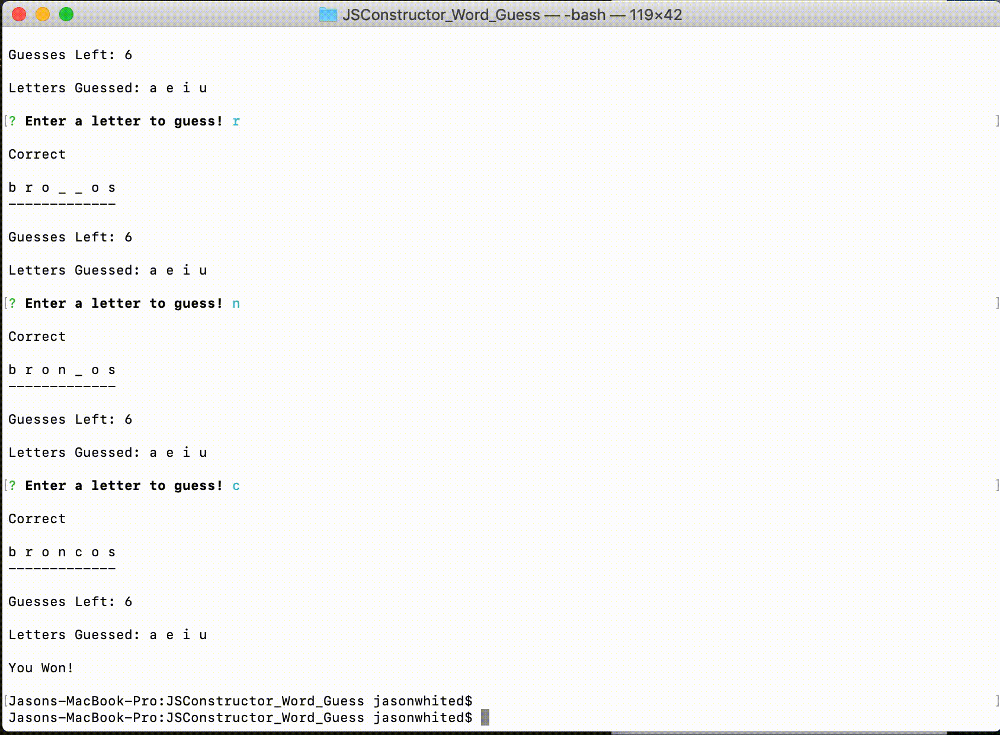
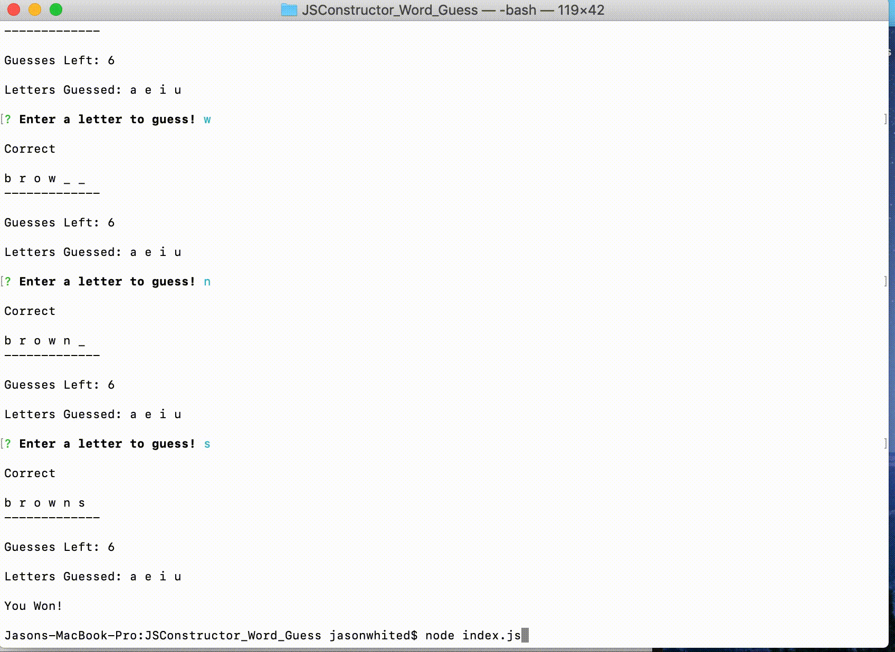

# Word Guess Using JavaScript and Node.js

This is a command line word guess game using JavaScript constructor functions and node.js.

Guess the NFL team in 10 trys and you win!

### Installing

Get the game started by entering 

```
node index.js
```

And the game starts! 

Select a letter and it will let you know if you are correct, wrong, and how many guesses you have left





If you get it wrong it will ask if you want to play again or exit




## Built With

* [JavaScript](https://www.javascript.com/)
* [Node.js](https://nodejs.org/en//) 
* [Inquier](https://www.npmjs.com/package/inquirer) 


